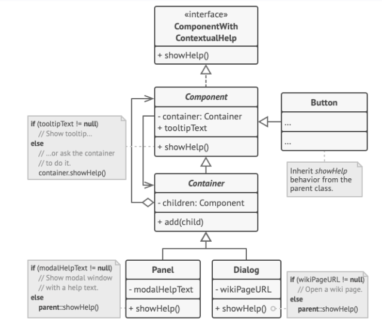
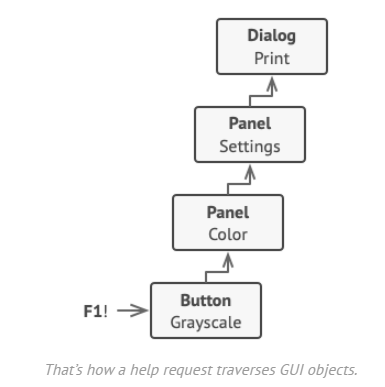

The application’s GUI is usually structured as an object tree. For example, the Dialog class, which renders the main window of the app, would be the root of the object tree. The dialog contains Panels, which might contain other panels or simple low-level elements like Buttons and TextFields.

A simple component can show brief contextual tooltips, as long as the component has some help text assigned. But more complex components define their own way of showing contextual help, such as showing an excerpt from the manual or opening a page in a browser.

When a user points the mouse cursor at an element and presses the F1 key, the application detects the component under the pointer and sends it a help request. The request bubbles up through all the element’s containers until it reaches the element that’s capable of displaying the help information.

